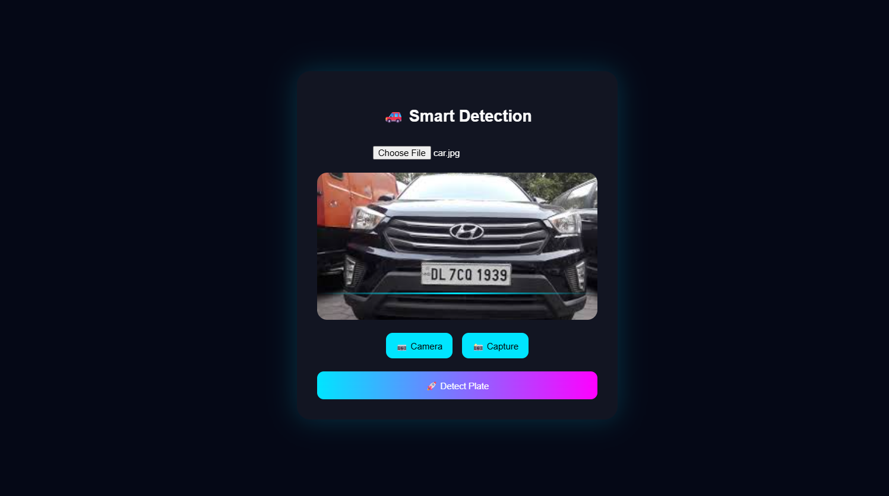
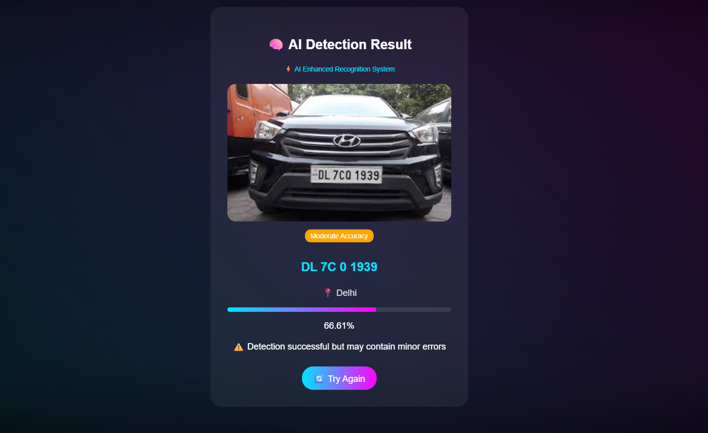

# Automatic Number Plate Recognition

## Overview

An AI-powered system that detects and recognizes vehicle number plates using Computer Vision.

## Technologies Used

- Python
- OpenCV
- Django

## Features

- Vehicle Detection
- Number Plate Detection
- OCR Processing
- Web Interface

## Future Improvements

- Real-time Camera Support
- Database Integration
- Dashboard Analytics

- # Automatic Number Plate Recognition

## Home Page

## Upload Page

## Detection Result

